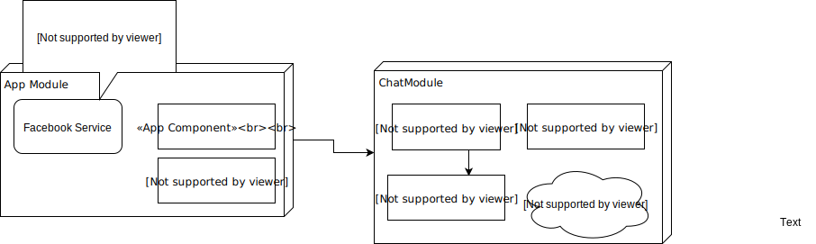

# PoC, messenger-chrome-extension

### What is it?
---
messenger-chrome-extension is a chrome extension that opens a popup which will allow the user to chat with their Facebook friends without having to switch tabs. This can be useful when you only want to send a quick message without having to look away from your favorite youtube video or if you're just browsing the internet.

### Features
---
| Feature       | Status        | 
| ------------- |:-------------:| 
| Login         | In progress   | 
| Chat          | To Do         | 
| Notification  | To Do         |

### What is it built on
---
This application is built with [Angularjs](https://angularjs.org/) and is bundle using [Webpack](https://webpack.github.io/).
The Front-end and Back-end is hosted seperately on [Heroku](https://www.heroku.com/) 

  
  
  

### Architecture
---

        

### Colaborators
---
Laurendy Lam  
Eric Xiao

 

